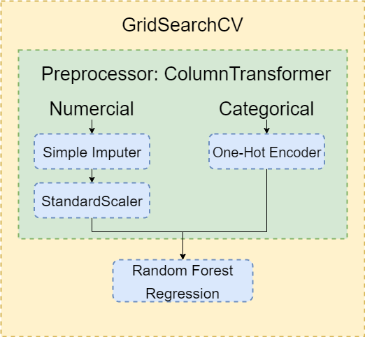
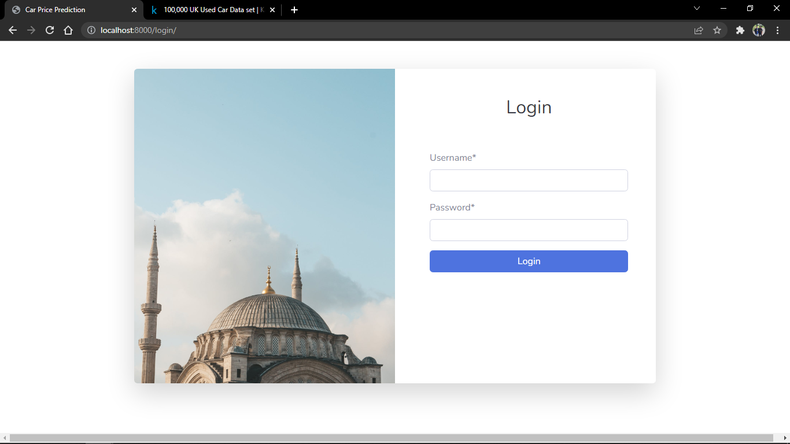
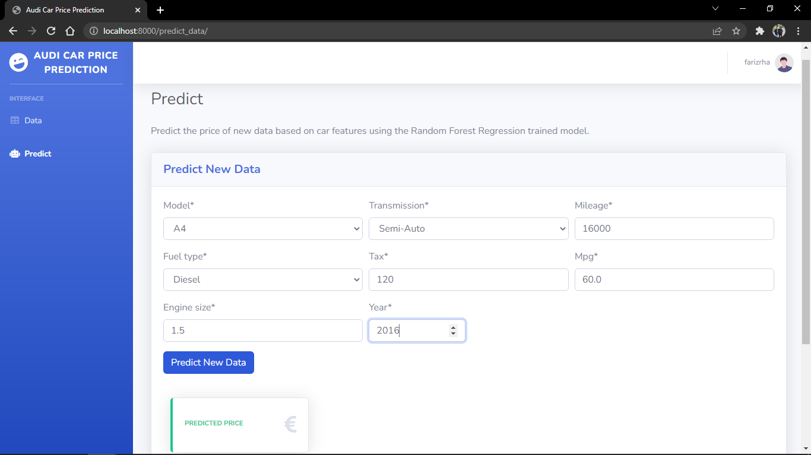
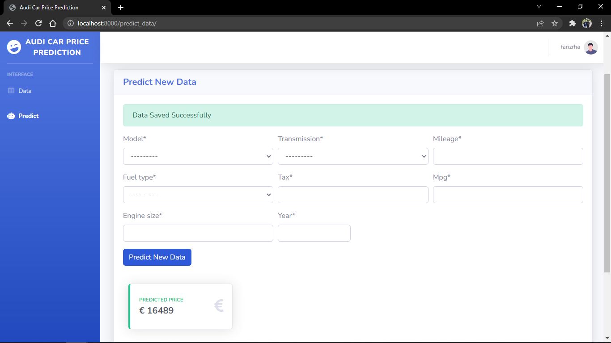
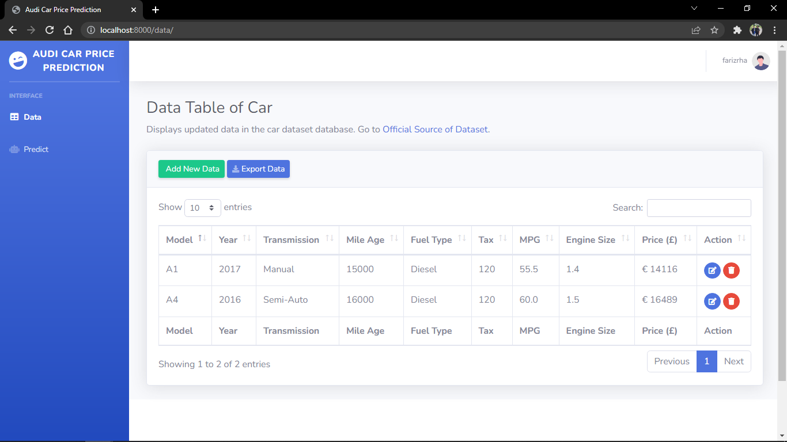
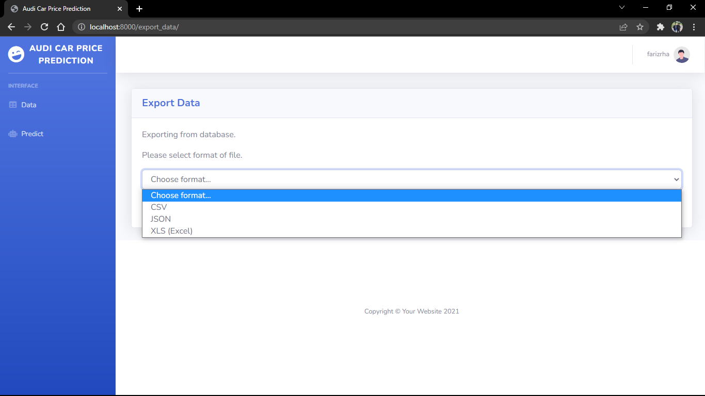
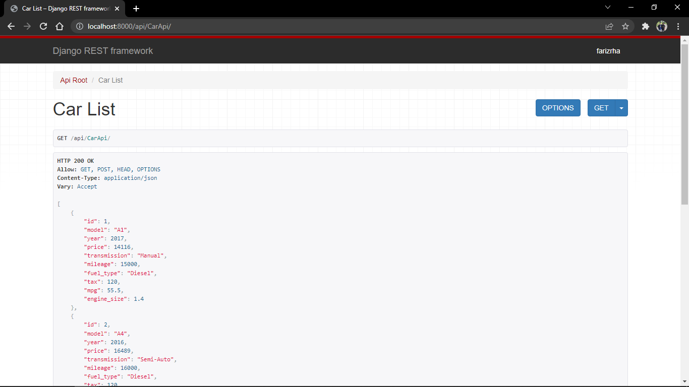

# Django Web Application Audi Car Price Prediction
Django web application to predict Audi Car prices from Kaggle datasets using Random Forest Regression trained model.

## About
In a real-world scenario, a business owner selling a lot of used cars needs to know a fair price based on the characteristics of the car itself. To solve the problem, we must
collect a lot of data to create a tool or model that is able to make price predictions based on previously collected data. That's why I decided to develop a Django web app for
provides users with interactive UI to make Audi Car price predictions.

## Machine Learning Details
 
  - Type of Problem : Supervised Machine Learning (Regression Problem)
  - Model to Use   : Random Forest Regression

## Dataset
Dataset obtained from [Here](https://www.kaggle.com/adityadesai13/used-car-dataset-ford-and-mercedes) with title '100,000 UK Used Car Data set', in this project I only use
Audi Car Dataset to train machine learning model to make car price prediction.

## Pipeline Diagram
   
   - Model development is built using pipelines to help automate machine learning workflows and perform ETL process by the help of Pandas library. The figure below shows a diagram of how the pipeline works, where numerical and categorical data have their own treatment by using ColumnTransformer allows us to selectively apply data preparation transforms like simple imputer, one-hot encoder and standard sclaer. To prevent overfitting and find the best param to minimize errors we can use GridSearchCV to do cross-validation with the total number of folds is 5.
   
        
   
   Source: https://scikit-learn.org/stable/auto_examples/compose/plot_column_transformer_mixed_types.html
   
   - My code will use pickle module to dump the object of pipeline where the mode already trained will be serialized into a byte stream to store it in a file which will be use for django web app to predict new data. 
   My Code: [Here](jupyter-notebook/Audi_Car_Price_Prediction.ipynb)
  
## Evaluation of the Model

  - Score Based on Mean Absolute Error (MAE) : 1853.550

## Web App Built with
* Python 3.9.6
* Django 3.2.11
* DB SQLite
* Bootstrap Framework

## Dependencies
* Can be seen [Here](requirements.txt)

## Installation & How to Use

  1. Install All Package Requirements `pip install -r requirements.txt`

  2. Make Migration of the Model `python manage.py makemigrations` and `python manage.py migrate`

  3. Create Super User `python manage.py createsuperuser`

  4. Run the Web App `python manage.py runserver`
        
## Preview of the Web App

### Features
* Login Session
* CRUD Feature
* Predict New Data
* Export to (Json, CSV, XlS/Excel)
* Django Rest Framework API

### Login
   - To use the web app, it requires authentication of the user to be secure.
   

### Predict
   - We can make predictions about the price of a car by including the features that characterize the car itself and store it to database.

   
   
   
   

### Result
   - Prediction results can be seen through the data table below where we can perform CRUD operations and sort data.
   
   
   
### Export
   - We able to export data from database to various format like JSON, CSV or XlS/Excel
   
   
   
### API
   - We can serialize data from database to use as API using Django Rest Framework in JSON format.
   
   
