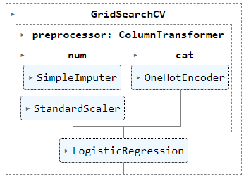

# Django Web Application Audi Car Price Prediction
Django web application to predict Audi Car prices from Kaggle datasets using Random Forest Regression trained model.

## About
In a real-world scenario, a business owner selling a lot of used cars needs to know a fair price based on the characteristics of the car itself. To solve the problem, we must
collect a lot of data to create a tool or model that is able to make price predictions based on previously collected data. That's why I decided to develop a Django web app for
provides users with interactive U/I to make Audi Car price predictions.

## Machine Learning Details
 
  - Type of Problem : Supervised Machine Learning (Regression Problem)
  - Model to Use   : Random Forest Regression

## Pipeline Diagram
   
   - Model development is built using pipelines to help automate machine learning workflows. The figure below shows a diagram of how the pipeline works, where numerical and categorical data have their own treatment.
   
   
   
   Source: https://scikit-learn.org/stable/auto_examples/compose/plot_column_transformer_mixed_types.html
  
## Evaluation of the Model

  - Score Based on Mean Absolute Error (MAE) : 1853.550
  

## Dataset for trained the model
Dataset obtained from [Here](https://www.kaggle.com/adityadesai13/used-car-dataset-ford-and-mercedes) with title '100,000 UK Used Car Data set', in this project i just use
Audi Car Dataset to train machine learning model to make car price prediction.

# Model to Use

# Built with 💜
* Python 3.7.5
* Django 2.2.9 to 2.2.13 (security update)

# Dependencies
* pillow
* xlwt
* mysqlclient (optional)
 
# License
[MIT](https://github.com/HilmiZul/epkl3/blob/master/LICENSE)

---
update April 27, 2021: re-design models. Happy Fasting 🌙

update January 22, 2020: change admin UI to Bootstrap 4.4.1. Happy New Year 🎉

update September 23, 2019: add "who is verified this [title and content](https://github.com/HilmiZul/epkl3/commit/ce582a9becb009e334c57446d087ffaa71ce0cfb)?"

update September 19, 2019: fix duplicate file Bimbingan, fix bug URL

update September 12, 2019

update September 1, 2019

update August 24, 2019

update Maret 2, 2019
